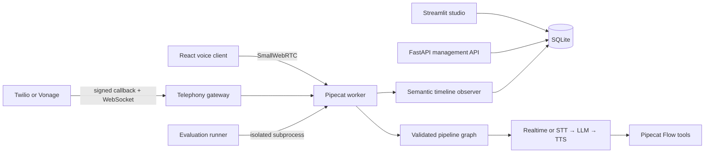

<div align="center">

# Pipecat Voice Studio

Build, run, inspect, and evaluate real-time voice agents from a local Streamlit workspace.

[](https://github.com/pypi-ahmad/pipecat-voice-studio/actions/workflows/quality.yml)
[](https://www.python.org/)
[](https://github.com/pipecat-ai/pipecat)
[](https://streamlit.io/)
[](LICENSE)

[GitHub repository](https://github.com/pypi-ahmad/pipecat-voice-studio) · [How to use](docs/HOW_TO_USE.md) · [Technical guide](docs/TECHNICAL.md) · [Documentation index](#documentation)

</div>

Pipecat Voice Studio is a local-first development and operations console for building voice and multimodal agents with [Pipecat](https://github.com/pipecat-ai/pipecat). It combines a Streamlit control plane, a React browser voice client, a separate Pipecat worker, a management API, and SQLite-backed session records in one repository.

The current implementation supports browser and telephone voice sessions, low-latency OpenAI Realtime and cascaded pipelines, business routing, appointments, CRM capture, avatar video, privacy-focused healthcare intake, semantic timelines, and isolated behavioral evaluations.

> [!IMPORTANT]
> The project currently targets local development and trusted networks. The management API has no authentication, and the included SmallWebRTC and SQLite configuration is not an internet-scale production deployment.

## Index

- [Features](#features)
- [Architecture](#architecture)
- [Built-in agents](#built-in-agents)
- [Technology stack](#technology-stack)
- [Getting started](#getting-started)
- [Optional provider setup](#optional-provider-setup)
- [Using the studio](#using-the-studio)
- [Management API](#management-api)
- [Development and testing](#development-and-testing)
- [Project structure](#project-structure)
- [Documentation](#documentation)
- [Project scope](#project-scope)
- [References](#references)
- [License](#license)

## Features

- **Visual agent studio** — inspect seeded pipeline graphs and clone them with a different name, prompt, or voice.
- **Browser voice sessions** — connect a microphone through Pipecat SmallWebRTC and receive streamed responses.
- **Two live pipeline modes** — combined OpenAI Realtime or a cascaded STT, turn detection, LLM, Flow, and TTS pipeline.
- **Appointment agent** — collect details, check local availability, require explicit confirmation, and create 30-minute bookings.
- **Safe pipeline contracts** — Pydantic schemas allow only audited node kinds and configuration fields; executable paths must be connected, acyclic chains.
- **Semantic timelines** — retain final turns, interruptions, Flow transitions, tool lifecycle events, metrics, and terminal state without storing raw audio.
- **Records and analytics** — review final conversation turns, appointments, evaluation history, and aggregate operational counts.
- **Behavioral evaluations** — run allowlisted scenarios in an isolated worker and temporary database, including interruption and synthetic-audio paths.
- **Management API** — query health and create or inspect validated pipeline definitions through FastAPI.
- **Telephone agents** — receive and place allowlisted Twilio or Vonage calls through native Pipecat WebSocket serializers, with signed callbacks and redacted records.
- **Connected operations** — synchronize confirmed bookings with Google Calendar, consent-gated leads with HubSpot, and transfer telephone callers to configured humans.
- **Specialized experiences** — route among business specialists, render Simli avatar video, and run consent-first encrypted healthcare intake without transcript retention.
- **Windows and Linux CI** — validate the lockfile, launchers, linting, types, tests, frontend, and Python package on both platforms.

## Architecture



The Streamlit process is the operator interface. Browser media connects directly to the separate Pipecat worker; provider credentials remain server-side. The worker reloads and compiles the selected graph, constructs the appropriate Pipecat pipeline, and records selected semantic events through the shared persistence layer.

Three pipeline modes are implemented:

| Mode | Processing path | Use |
|---|---|---|
| `realtime` | Browser → context → OpenAI Realtime → browser | Low-latency general conversation |
| `cascade` | Browser or phone → STT → turn detection → context → LLM → optional Flow/avatar → TTS → output | Appointment, business, healthcare, or avatar conversation |
| `eval` | EvalTransport → cascaded pipeline | Behavioral regression evaluation |

See the [technical guide](docs/TECHNICAL.md) and [architecture document](docs/codebase/ARCHITECTURE.md) for implementation details and data flows.

## Built-in agents

The studio seeds seven validated pipelines and restores any missing seed on startup:

| Pipeline | Transport | Purpose |
|---|---|---|
| Realtime assistant | Browser | Low-latency general voice conversation |
| Cascaded appointment assistant | Browser | Local availability checks and confirmed bookings |
| Appointment evaluation | Evaluation transport | Isolated behavioral regression scenarios |
| Business phone agent | Twilio or Vonage | Reception, billing, technical support, lead capture, and human handoff |
| Google Calendar appointment assistant | Browser | Availability and bookings synchronized with Google Calendar |
| Simli avatar assistant | Browser | Cascaded voice conversation with streamed avatar video |
| Healthcare intake assistant | Browser | Consent-first encrypted structured intake with transcript suppression |

## Technology stack

| Area | Technology |
|---|---|
| Voice orchestration | Pipecat 1.7.0, Pipecat Flows, Pipecat Evals |
| Application UI | Streamlit 1.62.0 |
| Browser component | React 19, TypeScript 5.9, Vite 8, Pipecat client SDK |
| Management API | FastAPI and Uvicorn |
| External providers | Twilio, Vonage, Google Calendar, HubSpot, and Simli |
| Security primitives | PyJWT, google-auth, and cryptography/AES-GCM |
| Validation/configuration | Pydantic and Pydantic Settings |
| Persistence | SQLite with WAL and foreign-key enforcement |
| Python environment | Python 3.13–3.14 and uv |
| ML runtime | PyTorch and torchvision CUDA 13.2 wheels |
| Quality | Ruff, ty, pytest, pytest-cov, GitHub Actions |

## Getting started

### Prerequisites

- Native 64-bit Windows 11, or native x86-64 Linux with glibc 2.34+ (Ubuntu 22.04+)
- PowerShell on Windows; Bash plus `curl` or `wget` on Linux
- Node.js and npm only when rebuilding the React component
- An OpenAI API key for live voice sessions and model-backed evaluations
- A browser with microphone permission
- A CUDA 13.2-compatible NVIDIA environment for GPU acceleration; CPU mode is supported

The launchers install `uv` when needed, reuse an installed Python 3.14.7 or install it through `uv`, and fall back to Python 3.13.13 if required. Docker and WSL are not required or used.

### Clone and launch

On Windows, double-click `launch.cmd`. You can also launch from PowerShell:

```powershell
git clone https://github.com/pypi-ahmad/pipecat-voice-studio.git
Set-Location pipecat-voice-studio
.\launch.cmd
```

On Linux:

```bash
git clone https://github.com/pypi-ahmad/pipecat-voice-studio.git
cd pipecat-voice-studio
./launch.sh
```

Each launcher creates `.venv` and `.env` in the repository root, synchronizes the locked dependencies,
starts the Pipecat worker and telephony gateway, optionally starts Calendar sync and the management
API, then runs Streamlit at [http://127.0.0.1:8501](http://127.0.0.1:8501). Configure
`OPENAI_API_KEY` before starting a live voice session.

Use `-WithApi` on Windows or `--with-api` on Linux to also start FastAPI. Use `-SetupOnly` or `--setup-only` to prepare the project without starting services.

> [!NOTE]
> The Linux evaluation dependency requires glibc 2.34 or newer. ARM64 and musl-based distributions are not currently supported.

### Optional provider setup

Copy values into the root `.env` file, or expose them as environment variables before launching. The **Integrations** page reports whether each provider is ready without displaying secrets.

| Capability | Required configuration |
|---|---|
| Twilio | `PVS_PUBLIC_BASE_URL`, `TWILIO_ACCOUNT_SID`, `TWILIO_AUTH_TOKEN`, and `TWILIO_FROM_NUMBER` |
| Vonage | `PVS_PUBLIC_BASE_URL`, `VONAGE_APPLICATION_ID`, `VONAGE_API_KEY`, `VONAGE_PRIVATE_KEY`, `VONAGE_SIGNATURE_SECRET`, and `VONAGE_FROM_NUMBER` |
| Outbound calls | An exact E.164 destination in `PVS_OUTBOUND_ALLOWLIST`; no wildcard matching is supported |
| Human handoff | `TWILIO_HANDOFF_DESTINATION` or `VONAGE_HANDOFF_DESTINATION` |
| Google Calendar | `GOOGLE_SERVICE_ACCOUNT_JSON` and `GOOGLE_CALENDAR_ID` |
| HubSpot CRM | `HUBSPOT_PRIVATE_APP_TOKEN`; the agent records a lead only after explicit consent |
| Simli avatar | `SIMLI_API_KEY` and `SIMLI_FACE_ID` |
| Healthcare intake | `PVS_HEALTHCARE_ENABLED=true`, a URL-safe base64 32-byte `PVS_HEALTHCARE_DATA_KEY`, and an approved model service in `PVS_HEALTHCARE_APPROVED_SERVICES` |

Twilio and Vonage require a public HTTPS origin that forwards to the local callback gateway on port `8080`. Callback signatures are verified before calls are accepted. Follow the [provider runbook](docs/PROVIDERS.md) for callback URLs, account-side configuration, key generation, synchronization, and troubleshooting.

### Manual startup

If the environment is already synchronized, start the worker manually:

```powershell
uv run python -m pipecat_voice_studio.voice.bot `
  --host 127.0.0.1 `
  --port 7860 `
  --allowed-origins http://localhost:8501 http://127.0.0.1:8501
```

For telephone providers, also start the callback gateway and forward an HTTPS tunnel to port 8080:

```powershell
uv run uvicorn pipecat_voice_studio.telephony_gateway:app --host 127.0.0.1 --port 8080 --proxy-headers --forwarded-allow-ips 127.0.0.1
```

When Google Calendar is configured, start synchronization:

```powershell
uv run python -m pipecat_voice_studio.calendar_worker
```

Then start Streamlit in another terminal:

```powershell
uv run streamlit run src/pipecat_voice_studio/ui/streamlit_app.py
```

Open [http://localhost:8501](http://localhost:8501), go to **Live session**, select a browser
pipeline, permit microphone access, and connect. Telephone pipelines are bound and operated from
**Integrations**.

> [!NOTE]
> The studio creates or migrates schema version 2 and ensures all built-in realtime, cascade,
> telephone, calendar, avatar, healthcare, and evaluation graphs exist.

## Using the studio

Every page includes an expanded **How to use this page** panel with its immediate workflow and expected result.

| Page | Purpose |
|---|---|
| Command center | View runtime readiness and studio overview |
| Agent studio | Inspect, validate, clone, and activate pipeline graphs |
| Live session | Start a browser voice conversation, toggle the microphone, and inspect live transcripts, tools, and metrics |
| Integrations | Check provider readiness, bind telephone pipelines, and place confirmed allowlisted calls |
| Records | Review sessions, appointments, redacted calls, handoffs, and healthcare metadata |
| Evaluations | Execute allowlisted Pipecat scenarios and review diagnostics |
| Analytics | View session, completion, appointment, and tool-event counts |

Live audio and browser media tracks are not written to the database. Healthcare sessions suppress
conversation turns and encrypt structured intake. Telephone records contain redacted numbers.

## Management API

Start the API separately:

```powershell
uv run uvicorn pipecat_voice_studio.api.app:app --host 127.0.0.1 --port 8000
```

OpenAPI documentation is available at [http://127.0.0.1:8000/docs](http://127.0.0.1:8000/docs).

| Method | Endpoint | Purpose |
|---|---|---|
| `GET` | `/health` | Runtime, dependency, CUDA, and GPU readiness |
| `GET` | `/pipelines` | Pipeline metadata |
| `GET` | `/pipelines/{pipeline_id}` | One active validated graph |
| `POST` | `/pipelines` | Validate, compile, and save a graph |

## Development and testing

Run the Python quality suite:

```powershell
uv lock --check
uv run ruff check .
uv run ty check
uv run pytest
uv build
```

Python coverage must remain at or above 80%. Model-backed live evaluations are opt-in and are never executed by the normal pull-request test run.
The Quality workflow runs on native Windows and Ubuntu and validates each platform's launcher in setup-only mode.

After changing the browser component:

```powershell
Set-Location src\pipecat_voice_studio\ui\frontend
npm ci
npm run build
```

The repository does not document a custom branching model. Keep changes focused, include relevant tests, and ensure the Quality workflow passes before submitting a pull request.

## Project structure

```text
.
├── .github/workflows/              # Quality and manual live-evaluation workflows
├── docs/                           # Technical and codebase documentation
├── launch.cmd                      # Double-clickable Windows launcher
├── launch.ps1                      # Native Windows setup and launcher
├── launch.sh                       # Native Linux setup and launcher
├── src/pipecat_voice_studio/
│   ├── api/                        # FastAPI management surface
│   ├── eval_scenarios/             # Allowlisted evaluation scenarios
│   ├── integrations/               # Google, HubSpot, telephone, and readiness adapters
│   ├── ui/                         # Streamlit pages and React component bridge
│   ├── voice/                      # Pipecat worker, specialist/intake Flows, and timeline observer
│   ├── appointments.py             # Booking policy
│   ├── calendar_worker.py          # Google incremental sync process
│   ├── evaluations.py              # Isolated evaluation runner
│   ├── graph.py                    # Pipeline schema and compiler
│   ├── security.py                 # Signatures, tokens, redaction, and encryption
│   ├── telephony_gateway.py        # Twilio/Vonage callback and media ASGI app
│   └── storage.py                  # SQLite repository
├── tests/                          # Unit, integration, UI smoke, and live tests
├── .env.example                    # Configuration template
└── pyproject.toml                  # Package, dependencies, and quality configuration
```

## Documentation

| Document | Description |
|---|---|
| [How to use](docs/HOW_TO_USE.md) | Installation, configuration, processes, studio workflows, evaluations, development checks, and troubleshooting |
| [Technical guide](docs/TECHNICAL.md) | Runtime architecture, pipelines, storage, API, security, operations, and troubleshooting |
| [Provider runbook](docs/PROVIDERS.md) | Twilio, Vonage, Google Calendar, HubSpot, Simli, healthcare setup, operations, and troubleshooting |
| [Architecture diagrams](docs/diagrams/README.md) | System architecture, live-session sequence, semantic data flow, module dependencies, and SQLite relationships |
| [Technology stack](docs/codebase/STACK.md) | Runtime versions, dependencies, tools, commands, and configuration |
| [Codebase structure](docs/codebase/STRUCTURE.md) | Directory map, entry points, and module boundaries |
| [Architecture](docs/codebase/ARCHITECTURE.md) | System flow, responsibilities, patterns, and architectural risks |
| [Coding conventions](docs/codebase/CONVENTIONS.md) | Naming, imports, error handling, logging, and testing conventions |
| [External integrations](docs/codebase/INTEGRATIONS.md) | Provider, WebRTC, persistence, secrets, reliability, and observability boundaries |
| [Testing patterns](docs/codebase/TESTING.md) | Test stack, layout, isolation, coverage, and CI behavior |
| [Codebase concerns](docs/codebase/CONCERNS.md) | Prioritized security, scaling, maintenance, and intent questions |

## Project scope

Implemented today: browser and telephone voice sessions, realtime and cascaded OpenAI pipelines, local and Google-backed appointments, HubSpot lead capture, human transfer, business-specialist routing, Simli avatar video, encrypted healthcare intake, semantic persistence, analytics, management API, and behavioral evaluation infrastructure.

This remains a local operator application. Internet-scale hosting, user authentication/RBAC, regulated healthcare certification, arbitrary custom provider loading, and high-availability deployment are not included.

## References

- [Pipecat repository](https://github.com/pipecat-ai/pipecat)
- [Pipecat documentation](https://docs.pipecat.ai/)
- [Pipecat pipelines and frame processing](https://docs.pipecat.ai/pipecat/learn/pipeline)
- [Pipecat supported services](https://docs.pipecat.ai/api-reference/server/services/supported-services)
- [Streamlit documentation](https://docs.streamlit.io/)
- [uv documentation](https://docs.astral.sh/uv/)
- [PyTorch](https://pytorch.org/)
- [Twilio Voice](https://www.twilio.com/docs/voice)
- [Vonage Voice API](https://developer.vonage.com/en/voice/voice-api/overview)
- [Daily](https://docs.daily.co/)
- [LiveKit](https://docs.livekit.io/)

## License

Pipecat Voice Studio is available under the [MIT License](LICENSE).
