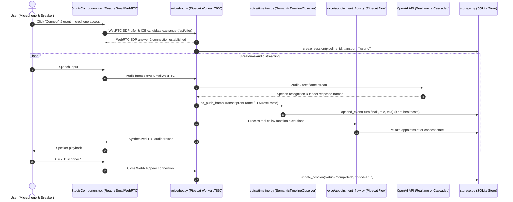
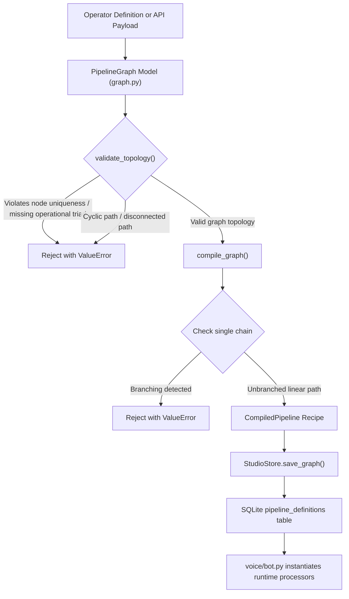
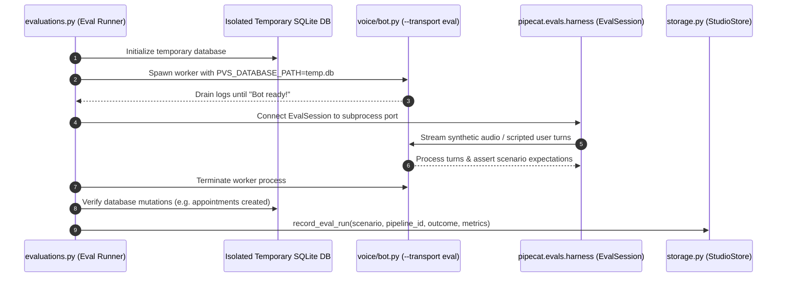
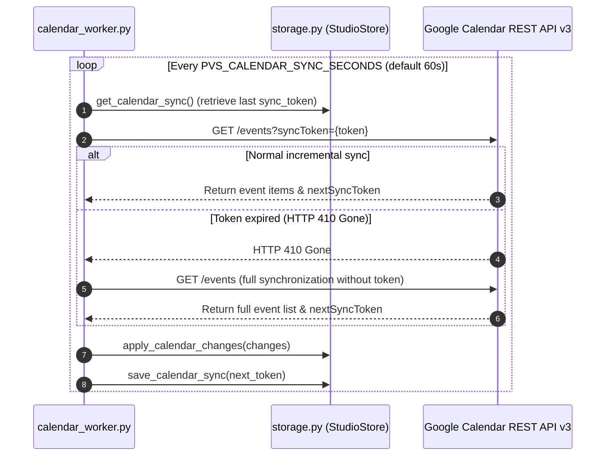

# Architecture

This document describes the runtime architecture, request and data flows, data structures, and external integration boundaries of Pipecat Voice Studio.

## System overview

Pipecat Voice Studio consists of five communicating subsystems operating on a single host:

1. User interface control plane: Multi-page [Streamlit](file:///D:/AI/Github/pipecat-voice-studio/src/pipecat_voice_studio/ui/streamlit_app.py) application for configuring pipelines, managing sessions, reviewing records, running evaluations, and monitoring runtime health.
2. Interactive client component: Custom React 19 component ([StudioComponent.tsx](file:///D:/AI/Github/pipecat-voice-studio/src/pipecat_voice_studio/ui/frontend/src/StudioComponent.tsx)) embedded in Streamlit via Streamlit Components v2, providing pipeline graph visualization with `@xyflow/react` and direct browser audio/video transport using `@pipecat-ai/small-webrtc-transport`.
3. Pipecat audio worker: Dedicated Python worker process ([bot.py](file:///D:/AI/Github/pipecat-voice-studio/src/pipecat_voice_studio/voice/bot.py)) executing Pipecat pipelines over SmallWebRTC, WebSocket, or evaluation transports.
4. Telephony callback and media gateway: FastAPI ASGI application ([telephony_gateway.py](file:///D:/AI/Github/pipecat-voice-studio/src/pipecat_voice_studio/telephony_gateway.py)) authenticating incoming webhooks from Twilio and Vonage and streaming bidirectional audio over WebSockets.
5. Persistent storage layer: Local SQLite database managed by [StudioStore](file:///D:/AI/Github/pipecat-voice-studio/src/pipecat_voice_studio/storage.py#L29-L277) operating in Write-Ahead Logging (WAL) mode with foreign key enforcement and 5000ms busy timeout handling.

Optional background processes include:
- Calendar synchronization worker: Periodic polling process ([calendar_worker.py](file:///D:/AI/Github/pipecat-voice-studio/src/pipecat_voice_studio/calendar_worker.py)) syncing Google Calendar events into local appointment records.
- Management API: FastAPI application ([api/app.py](file:///D:/AI/Github/pipecat-voice-studio/src/pipecat_voice_studio/api/app.py)) exposing health status and pipeline compilation over HTTP.

## Request and data flows

### Browser voice session flow

During an interactive browser voice session, the React client negotiates WebRTC directly with the Pipecat audio worker:



### Telephony voice session flow

Incoming telephone calls from Twilio or Vonage are authenticated by the gateway and proxied to the Pipecat pipeline:

```mermaid
sequenceDiagram
    autonumber
    actor Caller as Telephone Caller
    participant Carrier as Carrier (Twilio or Vonage)
    participant Gateway as telephony_gateway.py (:8080)
    participant Security as security.py (Signature & Token Verification)
    participant Worker as voice/bot.py (run_pipeline)
    participant DB as storage.py (SQLite Store)

    Caller->>Carrier: Dial phone number
    Carrier->>Gateway: POST /telephony/{provider}/answer (Webhook)
    Gateway->>Security: verify_twilio_signature / verify_vonage_webhook
    Gateway->>DB: get_integration_binding(provider)
    Gateway->>DB: create_call(provider, remote_digest, remote_last_four)
    Gateway->>Security: sign_media_token(call_id, secret)
    Gateway-->>Carrier: Return TwiML <Stream> or Vonage NCCO with WebSocket URL & token
    Carrier->>Gateway: WebSocket /telephony/{provider}/media/{token}
    Gateway->>Security: verify_media_token(token, secret)
    Gateway->>Worker: run_pipeline(FastAPIWebsocketTransport, pipeline_id)
    Worker->>DB: create_session(pipeline_id, transport="telephony", call_id)
    Carrier<-->>Worker: Bidirectional audio streaming (Twilio/Vonage FrameSerializer)
    Carrier->>Gateway: POST /telephony/{provider}/status or /events
    Gateway->>DB: update_call(status, ended)
```

### Pipeline compilation and validation flow

Pipelines are authored or cloned in the Agent Studio UI or received via the management API:



### Evaluation runner flow

Automated evaluations execute scenarios in an isolated worker subprocess using the evaluation transport:



### Google Calendar synchronization loop

The background calendar worker periodically retrieves incremental event changes:



## Main types and state

### Domain models and schema

| Type | Location | Purpose |
|---|---|---|
| [`PipelineGraph`](file:///D:/AI/Github/pipecat-voice-studio/src/pipecat_voice_studio/graph.py#L107-L236) | [graph.py](file:///D:/AI/Github/pipecat-voice-studio/src/pipecat_voice_studio/graph.py) | Serializable pipeline representation containing nodes and edges. Enforces topology constraints (acyclic, connected, operational triad presence). |
| [`GraphNode`](file:///D:/AI/Github/pipecat-voice-studio/src/pipecat_voice_studio/graph.py#L79-L96) | [graph.py](file:///D:/AI/Github/pipecat-voice-studio/src/pipecat_voice_studio/graph.py) | Node definition with allowlisted `NodeKind` and configuration restricted to `ALLOWED_CONFIG` (`prompt`, `voice`, `speed`, `language`, `vad_eagerness`). |
| [`GraphEdge`](file:///D:/AI/Github/pipecat-voice-studio/src/pipecat_voice_studio/graph.py#L98-L105) | [graph.py](file:///D:/AI/Github/pipecat-voice-studio/src/pipecat_voice_studio/graph.py) | Directed edge between source and target node identifiers. |
| [`CompiledPipeline`](file:///D:/AI/Github/pipecat-voice-studio/src/pipecat_voice_studio/graph.py#L238-L245) | [graph.py](file:///D:/AI/Github/pipecat-voice-studio/src/pipecat_voice_studio/graph.py) | Linear runtime recipe containing ordered node kinds, consolidated settings, and transport type. |
| [`Settings`](file:///D:/AI/Github/pipecat-voice-studio/src/pipecat_voice_studio/config.py#L21-L130) | [config.py](file:///D:/AI/Github/pipecat-voice-studio/src/pipecat_voice_studio/config.py) | Pydantic Settings model parsing and validating environment configuration and secret values. |
| [`StudioStore`](file:///D:/AI/Github/pipecat-voice-studio/src/pipecat_voice_studio/storage.py#L29-L277) | [storage.py](file:///D:/AI/Github/pipecat-voice-studio/src/pipecat_voice_studio/storage.py) | SQLite persistence repository managing transactions, schema initialization, migrations, and CRUD operations. |
| [`AppointmentBook`](file:///D:/AI/Github/pipecat-voice-studio/src/pipecat_voice_studio/appointments.py#L33-L174) | [appointments.py](file:///D:/AI/Github/pipecat-voice-studio/src/pipecat_voice_studio/appointments.py) | Business logic for 30-minute slot availability, timezone normalization, and explicit confirmation enforcement. |
| [`HealthcareCipher`](file:///D:/AI/Github/pipecat-voice-studio/src/pipecat_voice_studio/security.py#L58-L87) | [security.py](file:///D:/AI/Github/pipecat-voice-studio/src/pipecat_voice_studio/security.py) | AES-256-GCM authenticated cipher encrypting healthcare intake data with session ID bound as associated data. |
| [`SemanticTimelineObserver`](file:///D:/AI/Github/pipecat-voice-studio/src/pipecat_voice_studio/voice/timeline.py#L24-L129) | [voice/timeline.py](file:///D:/AI/Github/pipecat-voice-studio/src/pipecat_voice_studio/voice/timeline.py) | Pipecat BaseObserver implementation mapping pipeline frames to semantic timeline events while omitting raw audio. |

### SQLite database tables

Persistent state is stored across 14 tables in SQLite:

- `schema_version`: Tracks applied migration version (currently version 2).
- `pipeline_definitions`: Serialized JSON graph definitions and active flags.
- `sessions`: Session lifecycle records (mode, transport, duration, status, sensitivity, failure cause).
- `session_events`: Chronological event stream for sessions (`turn.final`, `turn.interrupted`, `tool.requested`, `metrics.observed`, etc.).
- `appointments`: Confirmed bookings with slot start timestamps, attendee names, purpose, and external provider references.
- `eval_runs`: Results, latency measurements, and assertions from automated evaluation executions.
- `integration_bindings`: Maps provider identifiers (`twilio`, `vonage`) to pipeline IDs.
- `calls`: Telephony call records with masked phone numbers (`remote_last_four`), HMAC digest (`remote_digest`), and call status.
- `handoffs`: Human escalation briefing text and target destinations.
- `calendar_sync_state`: Incremental synchronization tokens and timestamps for Google Calendar.
- `crm_records`: Consent-gated HubSpot contact and deal identifiers.
- `healthcare_consents`: Timestamped user consent records for healthcare intake.
- `healthcare_intakes`: Encrypted intake blobs (ciphertext, 12-byte nonce), escalation flags, and review status. Plaintext is never stored.
- `audit_events`: Security audit trail for sensitive administrative actions.

## External systems

Pipecat Voice Studio communicates with the following external APIs:

1. OpenAI API:
   - Realtime API (`wss://api.openai.com/v1/realtime`): Low-latency bidirectional WebSocket connection used for OpenAI Realtime voice sessions (`PVS_REALTIME_MODEL`, default `gpt-realtime-2.1-mini`).
   - Responses API: Large language model generation for cascaded pipelines (`PVS_CASCADE_LLM_MODEL`, default `gpt-5.6-luna`).
   - Whisper API: Streaming speech-to-text transcription (`PVS_CASCADE_STT_MODEL`, default `gpt-realtime-whisper`).
   - TTS API: Text-to-speech audio synthesis (`PVS_CASCADE_TTS_MODEL`, default `gpt-4o-mini-tts`).
2. Twilio Programmable Voice:
   - Webhook ingress: Signed HTTP POST callbacks received at `/telephony/twilio/answer` and `/telephony/twilio/status`.
   - Media streaming: Twilio Media Streams connected to `/telephony/twilio/media/{token}`.
   - REST API: Outbound call initiation and handoff bridging via `https://api.twilio.com/2010-04-01/Accounts/{AccountSid}/Calls.json`.
3. Vonage Voice API:
   - Webhook ingress: Signed HTTP callbacks received at `/telephony/vonage/answer` and `/telephony/vonage/events`.
   - Media streaming: WebSocket audio connected to `/telephony/vonage/media/{token}`.
   - REST API: Outbound call initiation and transfer via `https://api.nexmo.com/v1/calls`.
4. Google Calendar API:
   - REST API v3 (`https://www.googleapis.com/calendar/v3/calendars/{calendarId}/events`): Authenticated via Google Service Account OAuth2 credentials (`https://www.googleapis.com/auth/calendar` scope). Performs free/busy interval checks, event creation, event cancellation, and incremental change polling.
5. HubSpot CRM API:
   - REST API (`https://api.hubapi.com`): Authenticated using a Private App Bearer token. Used for contact batch upsert (`/crm/v3/objects/contacts/batch/upsert`), deal creation (`/crm/v3/objects/deals`), and note attachment (`/crm/v3/objects/notes`).
6. Simli Video Avatar Service:
   - Streaming API: Video generation driven by Pipecat's `SimliVideoService` using `SIMLI_API_KEY` and `SIMLI_FACE_ID` to render an animated visual avatar in the browser client.
