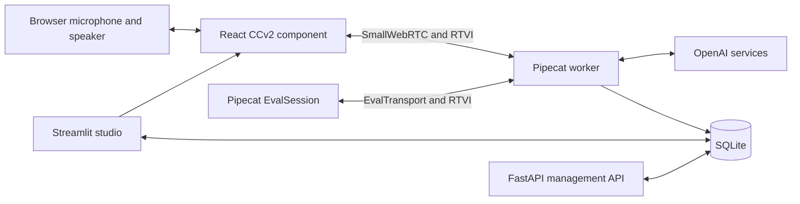

# Pipecat Voice Studio technical guide

## Purpose and audience

Pipecat Voice Studio is a local-first development environment for building, running, and
evaluating real-time voice agents. It combines a Streamlit control plane, a separate Pipecat
worker, a browser SmallWebRTC client, OpenAI speech and language services, and SQLite-backed
operational records.

This guide is for developers and operators working on the repository. It documents version
0.1.0 as implemented in the current codebase.

## System architecture



The application has three runtime boundaries:

1. **Streamlit studio** — displays pipeline definitions, launches browser sessions, browses
   records, runs evaluations, and displays analytics.
2. **Pipecat worker** — validates the selected pipeline and owns audio transport, model calls,
   turn handling, function calls, metrics, and session persistence.
3. **Browser component** — owns microphone permission, WebRTC media, live transcript state,
   device selection, mute state, tool indicators, and latency display.

The worker is intentionally a separate process. The Streamlit application probes its `/status`
endpoint but does not create or supervise it; `launch.ps1` and `launch.sh` supervise both
processes during launcher-managed runs.

## Repository structure

| Area | Responsibility |
| --- | --- |
| `src/pipecat_voice_studio/graph.py` | Closed graph schema, validation, and compilation |
| `src/pipecat_voice_studio/voice/` | Pipecat worker, pipeline construction, Flow, timeline observer |
| `src/pipecat_voice_studio/ui/` | Streamlit pages and Components v2 wrappers |
| `src/pipecat_voice_studio/ui/frontend/` | React graph and browser voice client |
| `src/pipecat_voice_studio/storage.py` | SQLite schema and transactional repository |
| `src/pipecat_voice_studio/evaluations.py` | Isolated evaluation orchestration |
| `src/pipecat_voice_studio/eval_scenarios/` | Allowlisted Pipecat evaluation scenarios |
| `src/pipecat_voice_studio/api/` | FastAPI health and pipeline management API |
| `.github/workflows/` | Quality checks and manually dispatched live evaluations |

## Pipeline model

Saved pipelines use `PipelineGraph`, a Pydantic model that rejects unknown fields and node
configuration. Executable nodes must form one connected, acyclic chain. Timeline, metrics, and
persistence nodes are mandatory operational capabilities.

### Supported modes

| Mode | Transport | Processing path | Intended use |
| --- | --- | --- | --- |
| `realtime` | SmallWebRTC | Browser → context → OpenAI Realtime → browser | Low-latency general voice assistant |
| `cascade` | SmallWebRTC | Browser → STT → turn detection → context → LLM → Flow → TTS → browser | Tool-using appointment assistant |
| `eval` | EvalTransport | Scripted input through the cascaded pipeline | Behavioral regression testing |

Runtime graphs select only audited implementations. A stored graph cannot inject Python code,
credentials, import paths, or arbitrary provider classes.

### Realtime path

The realtime pipeline uses `OpenAIRealtimeLLMService` with:

- input transcription;
- near-field noise reduction;
- semantic turn detection;
- interruption of active responses;
- streamed model audio output;
- a server-owned system prompt, language, voice, and VAD eagerness.

### Cascaded path

The cascaded pipeline uses:

1. `OpenAIRealtimeSTTService` for streaming transcription.
2. `SileroVADAnalyzer` through the user context aggregator.
3. `OpenAIResponsesLLMService` for reasoning and function calls.
4. Pipecat Flows for appointment collection, availability, and confirmation.
5. `OpenAITTSService` for streamed speech output.

Appointment creation is permitted only from the confirmation node with an affirmative
`confirmed` value. The appointment store independently validates timezone awareness, business
hours, half-hour boundaries, required fields, and slot uniqueness.

## Live browser session

The Streamlit Live session page passes only the worker URL and selected pipeline metadata to
the React component. It never sends an API key to the browser.

The component starts a session with:

```http
POST {PVS_BOT_BASE_URL}/start
Content-Type: application/json

{
  "transport": "webrtc",
  "enableDefaultIceServers": true,
  "body": {
    "pipeline_id": "<stored pipeline ID>"
  }
}
```

The Pipecat client then connects through the session-specific SmallWebRTC endpoint returned by
the runner. Live state remains inside React to avoid Streamlit reruns interrupting WebRTC.

The browser UI provides:

- connect and disconnect controls;
- microphone permission and input-device selection;
- mute and unmute controls;
- user and assistant speaking indicators;
- interim and final user transcripts;
- streamed assistant output;
- function-call lifecycle status;
- TTFB and processing metrics;
- mixed-content, device, and transport errors.

The transcript view retains at most 200 entries in browser memory. Browser transcript state is
ephemeral; durable semantic events are written by the worker.

## Semantic timeline and data retention

`SemanticTimelineObserver` maps selected Pipecat frames into ordered session events.

| Event | Stored data |
| --- | --- |
| `session.started` | Pipeline mode |
| `transport.connecting`, `transport.connected` | Transport name |
| `turn.final` | Final user or completed assistant text |
| `turn.interrupted` | Interruption marker |
| `flow.node` | Appointment Flow node and outcome |
| `tool.requested` | Function names and tool-call IDs |
| `tool.started` | Function name and tool-call ID |
| `tool.completed` | Function name, tool-call ID, and normalized status |
| `tool.cancelled` | Function name and tool-call ID |
| `metrics.observed` | Pipecat metric type and serialized metric fields |
| `session.completed`, `session.failed` | Terminal status |

The application deliberately does not persist raw audio, interim transcripts, unrestricted
tool arguments, API keys, or browser media tracks. Interrupted assistant text is discarded from
the final-turn buffer.

## Persistence

SQLite is configured with foreign keys, WAL journaling, a five-second busy timeout, and explicit
transactions. The default location is `data/pipecat_voice_studio.db`.

| Table | Purpose |
| --- | --- |
| `schema_version` | Rejects incompatible database layouts |
| `pipeline_definitions` | Validated graph JSON, revision, active status, timestamps |
| `sessions` | Frozen graph and model snapshot for each worker session |
| `session_events` | Ordered semantic timeline with per-session sequence numbers |
| `appointments` | Confirmation-gated local calendar records |
| `eval_runs` | Evaluation status and structured result JSON |

Deleting a session cascades to its timeline. Appointment references become null when their
session is deleted. Pipeline and appointment uniqueness are enforced by SQLite constraints.

## Behavioral evaluations

The Evaluations page runs only scenarios present in the packaged allowlist:

| Scenario | Assertion |
| --- | --- |
| `happy-path` | Availability and confirmation functions create one appointment |
| `unavailable-slot` | A preoccupied slot does not produce another appointment |
| `policy-denial` | Explicit denial leaves the appointment book empty |
| `interruption` | A user turn is accepted while assistant generation is active |
| `synthetic-audio-smoke` | Kokoro-generated speech traverses the real STT path |

Each run performs the following lifecycle:

1. Create an `eval_runs` record in the studio database.
2. Create a temporary SQLite database.
3. Copy the selected validated graph into the temporary database.
4. Add any scenario fixture, such as an occupied appointment slot.
5. Start a hidden localhost-only worker using `EvalTransport`.
6. Run `EvalSession` over RTVI.
7. Stop the worker and discard the temporary database.
8. Persist pass/fail status, failures, duration, observed events, and bounded diagnostics.

Model-backed evaluations are never triggered by normal tests or pull requests.

## Configuration reference

Configuration is loaded from environment variables or a project-root `.env` file.

| Variable | Default | Purpose |
| --- | --- | --- |
| `OPENAI_API_KEY` | None | Required for voice pipelines and live evaluations |
| `OPENAI_BASE_URL` | None | Optional compatible OpenAI endpoint |
| `PVS_ENVIRONMENT` | `development` | Environment label shown by diagnostics |
| `PVS_BOT_BASE_URL` | `http://127.0.0.1:7860` | Browser and Streamlit worker endpoint |
| `PVS_DATABASE_PATH` | `data/pipecat_voice_studio.db` | SQLite database path |
| `PVS_TIMEZONE` | `Asia/Calcutta` | IANA timezone for appointment policy |
| `PVS_REALTIME_MODEL` | `gpt-realtime-2.1-mini` | Realtime service model |
| `PVS_CASCADE_STT_MODEL` | `gpt-realtime-whisper` | Cascaded speech recognition model |
| `PVS_CASCADE_LLM_MODEL` | `gpt-5.6-luna` | Cascaded reasoning model |
| `PVS_CASCADE_TTS_MODEL` | `gpt-4o-mini-tts` | Cascaded speech synthesis model |
| `PVS_REALTIME_VOICE` | `marin` | Default voice |

`PVS_TIMEZONE` is validated as an IANA timezone during settings construction.
Launcher-managed runs override `PVS_BOT_BASE_URL` in child processes to match the selected
worker port; the documented default applies to manual process startup.

## Local development on Windows and Linux

### Prerequisites

- Native 64-bit Windows 11, or native x86-64 Linux with glibc 2.34+
- PowerShell on Windows; Bash and either `curl` or `wget` on Linux
- Node.js and npm for frontend changes
- An OpenAI API key for live model calls
- A CUDA 13.2-compatible environment for GPU acceleration; CPU mode is supported

### One-command setup and launch

Windows:

```powershell
powershell -ExecutionPolicy Bypass -File .\launch.ps1
```

Linux:

```bash
./launch.sh
```

Both launchers bootstrap `uv`, reuse or install Python 3.14.7 with a 3.13.13 fallback, create root `.venv` and `.env`, synchronize `uv.lock`, validate frontend assets, start the worker, wait for `/status`, and run Streamlit. If exactly one built JavaScript or CSS asset is absent, they rebuild the frontend with npm. Add `-WithApi` or `--with-api` to start the management API, or `-SetupOnly` or `--setup-only` to stop after setup. Worker, Streamlit, and API ports are configurable and must be distinct and available. Worker and API readiness time out after 30 seconds. Background logs are stored in `artifacts/launcher/`, `PVS_BOT_BASE_URL` is aligned with the selected worker port, and launcher-owned processes are stopped on exit.

Linux support requires glibc 2.34+ because the Pipecat evaluation dependency ships its x86-64 wheel at that baseline. ARM64 and musl Linux are not supported.

### Manual install

```powershell
uv sync --frozen
Copy-Item .env.example .env
```

Populate `OPENAI_API_KEY` in `.env`. Do not commit `.env` or Streamlit secrets files.

Build the Streamlit component after changing frontend source:

```powershell
Set-Location src\pipecat_voice_studio\ui\frontend
npm ci
npm run build
Set-Location ..\..\..\..
```

### Start the worker

```powershell
uv run python -m pipecat_voice_studio.voice.bot `
  --host 127.0.0.1 `
  --port 7860 `
  --allowed-origins http://localhost:8501 http://127.0.0.1:8501
```

### Start Streamlit

In another terminal:

```powershell
uv run streamlit run src\pipecat_voice_studio\ui\streamlit_app.py
```

Open `http://localhost:8501`, select Live session, choose a non-evaluation pipeline, and connect.

### Start the management API

```powershell
uv run uvicorn pipecat_voice_studio.api.app:app --host 127.0.0.1 --port 8000
```

OpenAPI documentation is available at `http://127.0.0.1:8000/docs` while the API is running.

## Management API reference

### `GET /health`

Returns application metadata, installed Python/Pipecat/Streamlit/PyTorch versions, CUDA
availability, and the detected GPU name.

### `GET /pipelines`

Returns pipeline metadata without graph bodies or credentials.

### `GET /pipelines/{pipeline_id}`

Returns one active `PipelineGraph`. A missing or inactive ID returns HTTP 404.

### `POST /pipelines`

Validates and compiles a complete `PipelineGraph`, stores it as active revision one, and returns:

```json
{"id": "<pipeline ID>"}
```

Validation failures return FastAPI's standard HTTP 422 response. Compilation failures reject
non-executable graph topology before persistence.

## Quality and CI

Run the complete local verification set with:

```powershell
uv lock --check
uv run ruff check .
uv run ty check
uv run pytest

Set-Location src\pipecat_voice_studio\ui\frontend
npm run typecheck
npm run build
Set-Location ..\..\..\..

uv build
```

The `Quality` workflow performs these checks on native Windows and Ubuntu for pushes, pull
requests, and manual dispatches. It also validates each launcher in setup-only mode. Python
coverage must remain at or above 80 percent.

The `Live evaluations` workflow is manual. Configure a protected GitHub environment named
`live-evals` with `OPENAI_API_KEY` and, when needed, `OPENAI_BASE_URL`. The workflow accepts one
scenario or `all` and uploads `live-evaluations.json` as an artifact.

## Security and deployment boundaries

- Provider credentials remain in the worker environment and are never included in component
  data or pipeline graph JSON.
- The graph schema is an allowlist, not a general code execution format.
- Browser microphone access requires localhost or HTTPS.
- An HTTPS Streamlit deployment cannot connect to an HTTP worker because browsers block mixed
  content.
- CORS origins must match the Streamlit origin passed to the worker.
- Evaluation subprocesses receive arguments as a list with no shell interpolation.
- Evaluation fixtures and generated audio are isolated in temporary storage.

The current system is designed for local development and trusted LAN use. Public deployment
requires authentication, HTTPS termination, production ICE/TURN configuration, authorization,
rate limiting, data-retention policy, monitoring, and threat review.

## Troubleshooting

### The Live session page reports that the worker is unavailable

1. Start the worker with the command shown on the page.
2. Confirm `PVS_BOT_BASE_URL` points to the same host and port.
3. Open `{PVS_BOT_BASE_URL}/status`; it should report `status: ready`.
4. Verify the worker's allowed origins include the exact Streamlit origin.

### Microphone permission fails

- Use `localhost`, `127.0.0.1`, or HTTPS.
- Confirm the browser has permission for the active Streamlit origin.
- Disconnect before changing operating-system audio devices.
- Avoid an HTTPS page with an HTTP worker URL.

### A pipeline fails immediately

- Confirm `OPENAI_API_KEY` exists in the worker environment.
- Confirm the selected graph mode matches the transport: `eval` requires EvalTransport;
  realtime and cascade require WebRTC.
- Review the session failure type and semantic events in Records.
- Verify configured model identifiers are supported by the selected endpoint.

### An evaluation does not start

- Confirm an evaluation-mode graph is selected.
- Confirm `OPENAI_API_KEY` is configured.
- Review the stored worker log in the evaluation result.
- On Windows, ensure security software permits the hidden child Python process and localhost
  WebSocket listener.

### The Streamlit component is blank

Rebuild from a clean frontend output directory:

```powershell
Set-Location src\pipecat_voice_studio\ui\frontend
npm ci
npm run clean
npm run build
```

The component manifest and Python registration must retain the fully qualified key
`pipecat-voice-studio.studio_graph`, and each `index-*.js` and `index-*.css` glob must match
exactly one built file.

## Current limitations

- SmallWebRTC is configured for local-first operation, not internet-scale deployment.
- The management API has no authentication.
- Only realtime, cascaded appointment, and evaluation graph modes are executable.
- Appointment storage is a local mock calendar rather than an external calendar provider.
- Telephony, production human handoff, CRM integration, healthcare controls, avatars, and
  multi-agent routing remain future integrations.
